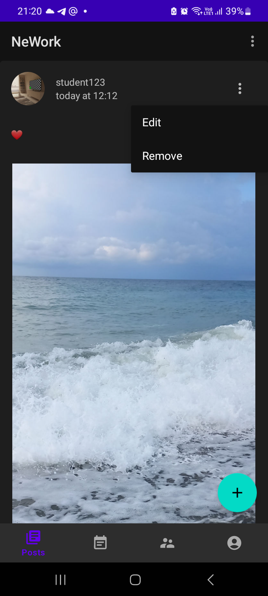

# Дипломное задание "NeWork" (Профессия Android Developer)
## Краткое описание:

В рамках дипломного проекта разработано мобильное приложение, напоминающее формат LinkedIn, в котором пользователи
могут создавать посты и события с медиаресурсами, а также указывать места работы

## Инструменты:

- архитектура MVVM
- библиотеки:
  - Material Design
  - Coroutines
  - Room
  - Retrofit
  - LiveData, Flow
  - Paging
  - Hilt
  - ImagePicker, Glide

## Описание ключевых функций и возможностей:

### Функционал, доступный неавторизованному пользователю

Точка входа в приложение - список постов всех пользователей, которые доступны для просмотра всем, в том числе неавторизованным пользователям.
Также неавторизованный пользователь может просматривать списки событий и пользователей (переход осуществляется через панель навигации).
Через верхнее меню осуществляется переход на экраны авторизации и регистрации пользователя.
Также на экран авторизации неавторизованный пользователь попадает при попытке создать новый пост/новое событие либо лайкнуть пост/событие либо нажать иконку Принять участие (для события).
Со страницы авторизации доступен переход на страницу регистрации.
При клике на аватар пользователя (в списке пользователей, на странице постов или событий) происходит переход в профиль пользователя, по умолчанию отображается список постов пользователя.
При клике на вкладку Места работы происходит переход к списку мест работы пользователя.

### Функционал, доступный авторизованному пользователю

Точка входа в приложение - также список постов всех пользователей.
Авторизованному пользователю доступно добавление постов, а также редактирование и удаление своих постов через меню поста.

При нажатии на кнопку Добавить или при выборе пункта меню Редактировать осуществляется переход на экран Добавления/Редактирования поста.
Аналогичный функционал доступен для списка событий.
Доступен для просмотра список пользователей.
Дополнительно через панель навигации можно перейти в Мой профиль, по умолчанию отображается список постов текущего пользователя.
Доступно добавление, а также редактирование и удаление постов через меню поста.

При нажатии на кнопку Добавить или при выборе пункта меню Редактировать осуществляется переход на экран Добавления/Редактирования поста.

При клике на вкладку Места работы происходит переход к списку мест работы текущего пользователя.
Доступно добавление, а также редактирование и удаление мест работы через меню.

При нажатии на кнопку Добавить или при выборе пункта меню Редактировать осуществляется переход на экран Добавления/Редактирования места работы.

Дополнительно авторизованному пользователю доступно проставление лайков для постов и событий и активация иконки Принять участие для событий, а также отмена указанных действий.

Данные действия доступны только для чужих постов и событий.
При нажатии на указанные выше иконки для созданных текущим пользователем постов или событий, происходит переход к списку пользователей, проставивших лайк либо нажавших иконку Принять участие.

